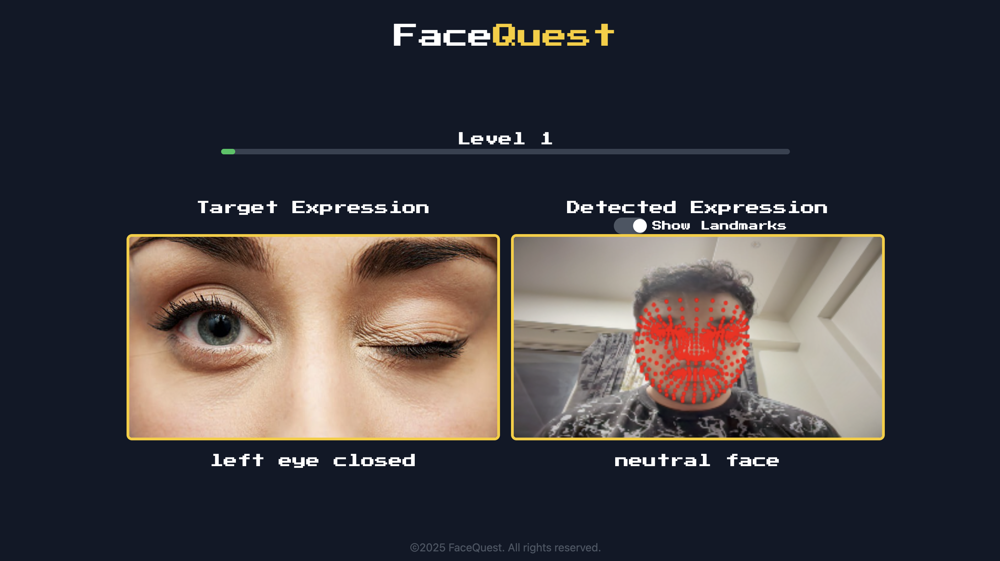

# 🎭 FaceQuest - The Ultimate Facial Expression Game!

Welcome to **FaceQuest**, an interactive and engaging game where your facial expressions control the gameplay! Test your ability to match various expressions, level up, and challenge yourself in this AI-powered experience.

## 🚀 Features
- 🎮 **Expression-Based Gameplay** – Perform specific facial expressions to progress through levels.
- 🧠 **AI-Powered Detection** – Uses **MediaPipe FaceMesh** for real-time face tracking.
- 📈 **10+ Levels of Increasing Difficulty** – Each level presents a new challenge.
- 🔊 **Retro Sound Effects** – Immerse yourself in a fun, arcade-style experience.
- 🎨 **Pixel-Art Inspired UI** – Nostalgic visuals with a modern touch.
<!-- - 🎯 **Dynamic Feedback** – Tracks accuracy, score, and progression. -->
<!-- - 🔄 **Game Reset Feature** – Restart anytime and improve your performance. -->

## 🛠️ Tech Stack
- **Frontend:** React.js, Tailwind CSS, Framer Motion
- **AI Models:** MediaPipe FaceMesh
- **State Management:** React Hooks
- **Audio Integration:** useSound Hook

## 🎯 How to Play
1. Click the **Start Game** button.
2. Observe the **target expression** displayed on the screen.
3. Match the expression using your face.
4. If detected correctly, level up and progress.
5. Complete all levels to win!
6. Click **Reset Game** to restart anytime.

## 📷 Screenshots


## 🏗️ Setup & Installation
1. **Clone the repository:**
   ```sh
   git clone https://github.com/OgAeons/FaceQuest.git
   cd FaceQuest
   ```
2. **Install dependencies:**
   ```sh
   npm install
   ```
3. **Run the game locally:**
   ```sh
   npm start
   ```
4. Open **http://localhost:3000** in your browser and start playing!

## 🤖 AI & Expression Detection
FaceQuest utilizes **MediaPipe FaceMesh** for detecting facial expressions. The game recognizes the following expressions:
- Left Eye Closed
- Right Eye Closed
- Head Turned Left
- Head Turned Right
- Smile 😊
- Sad Face 😢
- Surprised Face 😲
- Angry Face 😡

## 📌 Future Enhancements
- 🔥 **More Expressions & Levels**
- 🎭 **Multiplayer Mode**
- 📊 **Performance Analytics**
- 🏆 **Leaderboard & Achievements**

## 💡 Contributing
Contributions are welcome! Feel free to fork this repo and submit a pull request.

## 🌟 Acknowledgments
Special thanks to:
- **MediaPipe** for AI capabilities
- **Framer Motion** for animations
- **useSound** for immersive audio effects

---
Made with ❤️ by **[OgAeons](https://github.com/OgAeons)**

